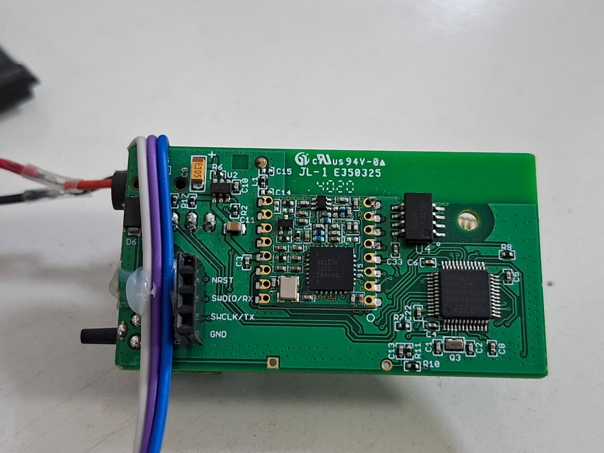
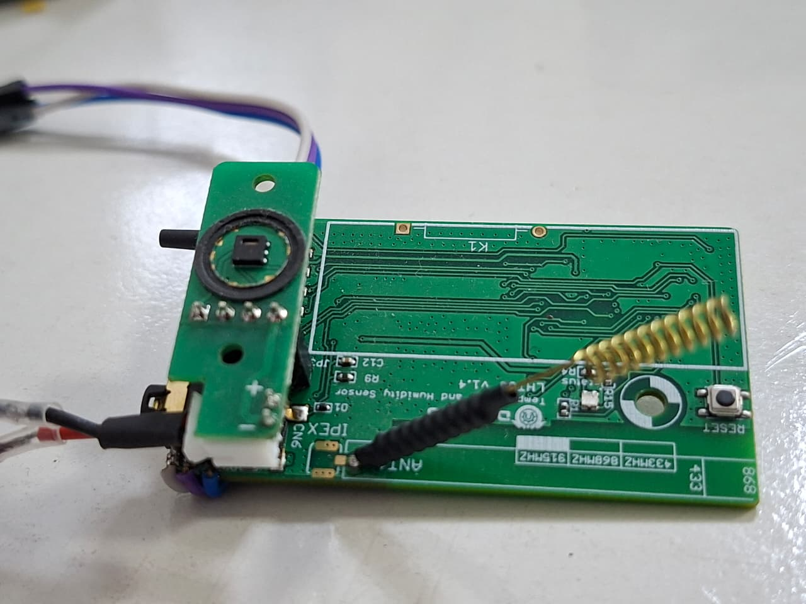
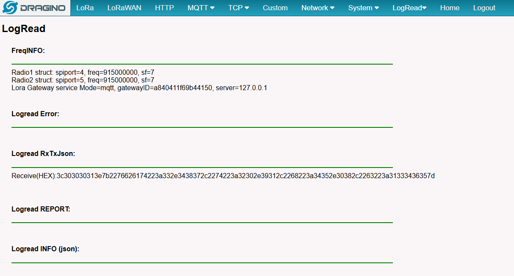
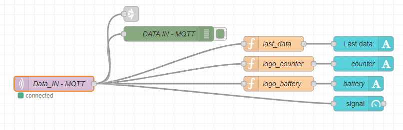
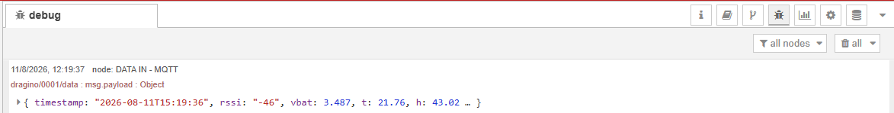
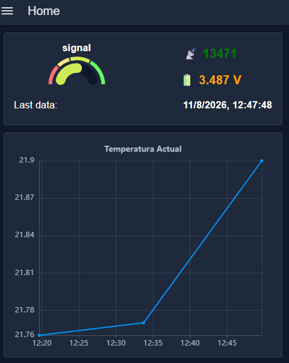

# Low-Power LoRa Sensor Node

## Overview

Development of a low-power embedded sensor node for periodic acquisition and wireless transmission of environmental and battery data using LoRa.

The project was developed by reprogramming a commercial Dragino sensor platform (LHT65-style enclosure) based on an STM32L072 microcontroller and an SX1276 LoRa transceiver. The original firmware was replaced with custom firmware to implement sensor acquisition, battery monitoring, LoRa communication, real-time clock management and low-power operation.

The node periodically acquires temperature, relative humidity and battery voltage, transmits the data through LoRa, and then enters a low-power state until the next scheduled measurement.

This is the physical-sensing layer of a broader portfolio pipeline: its telemetry is the real input later consumed by **01 — Industrial Transformer Digital Twin**, which in turn generates the representative dataset that **04 — Time-Series Machine Learning** needed once real telemetry (from a different device) proved too short to train on.

```
Physical sensing (this project) → Telemetry (LoRa/MQTT) → Digital modeling (01) → Time-series analysis / ML (04)
```

<p align="center">
  
</p>

<p align="center">
  <i>Original commercial sensor platform (Dragino LHT65-style enclosure) that was reprogrammed for this project.</i>
</p>

---

## System Architecture

```text
┌─────────────────────────┐
│      SHT20 Sensor       │
│ Temperature / Humidity  │
└────────────┬────────────┘
             │ I²C
             ▼
┌─────────────────────────┐
│       STM32L072         │
│                         │
│  Sensor acquisition     │
│  Battery monitoring     │
│  RTC / Low Power        │
└────────────┬────────────┘
             │ SPI
             ▼
┌─────────────────────────┐
│        SX1276           │
│      LoRa 915 MHz       │
└────────────┬────────────┘
             │ LoRa
             ▼
┌─────────────────────────┐
│      Dragino LG02       │
│         Gateway         │
└────────────┬────────────┘
             │ MQTT
             ▼
       Data Platform
```

## Hardware

* **Microcontroller:** STM32L072CZT6 (STM32L0 series, LQFP48)
* **LoRa transceiver:** SX1276
* **Temperature / humidity sensor:** SHT20
* **Real-time clock:** STM32 internal RTC
* **Battery monitoring:** ADC using internal voltage reference (VREFINT)

<p align="center">
  
  
</p>

<p align="center">
  <i>Sensor node hardware: repurposed Dragino PCB with the SX1276 transceiver, STM32L072 and SHT20 sensor.</i>
</p>

## Sensor Acquisition

Temperature and relative humidity are acquired from the SHT20 sensor through the STM32 I²C interface, using its hold-master read commands (`0xF3` for temperature, `0xF5` for humidity) and the sensor's standard linear conversion formulas.

Battery voltage is monitored through the STM32 ADC using its internal voltage reference (VREFINT) and the factory-calibrated reference value stored in system memory, allowing the firmware to estimate the actual supply voltage without a dedicated voltage-divider measurement.

The resulting telemetry — battery voltage, temperature, humidity and a running packet counter — is serialized into a compact JSON payload and prepared for wireless transmission.

## LoRa Communication

The SX1276 transceiver is controlled directly from the STM32 through SPI, writing configuration registers directly rather than using a vendor LoRa library.

The firmware configures the radio for operation at **915 MHz** using:

* Bandwidth: **125 kHz**
* Coding Rate: **4/5**
* Spreading Factor: **SF7**
* Transmit power: **14 dBm**
* Preamble: **8 symbols**

This is a point-to-point LoRa physical-layer link (register-level control of the SX1276), not a full LoRaWAN protocol stack — the Dragino gateway receives raw LoRa packets and forwards them, rather than acting as a LoRaWAN network server.

The transmission process writes the telemetry payload to the SX1276 FIFO, starts transmission and waits for the **TxDone** interrupt (via DIO0, handled through `HAL_GPIO_EXTI_Callback` and `__WFI()` to stay low-power while waiting) before returning the radio to sleep mode. A short LED pulse marks each transmission for visual debugging in the field.

<p align="center">
  
</p>

<p align="center">
  <i>Example of LoRa packets received from the custom sensor node, as logged by the Dragino gateway.</i>
</p>

## Low-Power Operation

The node was designed to operate periodically while minimizing power consumption.

The operating cycle is:

```text
Wake-up
   ↓
Read sensors
   ↓
Read battery voltage
   ↓
Build telemetry payload
   ↓
Transmit via LoRa
   ↓
SX1276 Sleep
   ↓
STM32 STOP Mode
   ↓
RTC Wake-up
   ↓
Repeat
```

The RTC is configured for a **15-minute wake-up interval** (900 s). After transmission, the SX1276 is placed in sleep mode and the STM32 enters STOP mode with the low-power regulator until the next RTC wake-up interrupt, re-initializing the system clock on resume.

## Gateway Integration

The sensor node was integrated with a **Dragino LG02** gateway for LoRa reception and forwarding of telemetry data over MQTT.

> ⚠️ **Note on the gateway configuration screenshot:** an earlier version of this README included a screenshot of the Dragino MQTT client configuration page. That image showed the broker's real public IP address and port in plain text (unencrypted MQTT). It has been removed from this README and should not be re-added — see the note at the end of this document.

## Data Pipeline

```text
Sensor Node
    ↓
   LoRa
    ↓
Dragino LG02
    ↓
   MQTT
    ↓
 Node-RED
    ↓
Data Storage / Processing
```

<p align="center">
  
</p>

<p align="center">
  <i>Telemetry data flow from MQTT through Node-RED.</i>
</p>

<p align="center">
  
</p>

<p align="center">
  <i>Incoming MQTT payload (topic <code>dragino/0001/data</code>) as received in Node-RED: timestamp, RSSI, battery voltage, temperature and humidity.</i>
</p>

<p align="center">
  
</p>

<p align="center">
  <i>Live dashboard view: packet counter, battery voltage and temperature trend.</i>
</p>

---

## Firmware Project

The firmware was developed in STM32CubeIDE. The project is defined by:

```text
firmware/LORA-TX1/
├── LORA-TX1.ioc          # CubeMX peripheral/pin configuration (STM32L072CZT6)
└── Core/
    ├── Inc/
    │   ├── main.h
    │   └── sx1276.h       # SX1276 pin mapping (SPI, NSS, RESET, DIO0) — adjust to your wiring
    └── Src/
        ├── main.c          # Sensor read, payload build, low-power cycle
        ├── sx1276.c         # Register-level SX1276 driver (init, send)
        └── stm32l0xx_it.c   # RTC wake-up and SX1276 DIO0 interrupt handlers
```

The vendor HAL driver sources generated by STM32CubeMX are not included — they are regenerated automatically from the `.ioc` file when the project is opened in STM32CubeIDE.

## Technologies

**Embedded:** STM32L072 · C · STM32 HAL · RTC · Low-Power Modes

**Sensors:** SHT20 · ADC · VREFINT · I²C

**Wireless:** SX1276 · LoRa (point-to-point, register-level) · SPI · 915 MHz

**Integration:** Dragino LG02 · MQTT · Node-RED

## Related Projects

This node is the data source at the start of the portfolio's telemetry pipeline:

- [**01 — Industrial Transformer Digital Twin**](https://github.com/maxiexe97/01-Industrial-Transformer-Digital-Twin/tree/main) — consumes this node's environmental telemetry (ambient temperature, timestamp) as input to a physics-based transformer model. The test payload used while building that project's model flow matches this firmware's JSON format directly (`vbat`, `t`, `h`, `c`, plus `timestamp`/`rssi` added by the gateway/Node-RED stage).
- [**04 — Time-Series Machine Learning**](https://github.com/maxiexe97/04-Time-Series-Machine-Learning) — downstream of the digital twin; the synthetic dataset the twin produces from telemetry like this is intended to give that project enough history to revisit the forecasting approach that a shorter, real dataset couldn't support.

---

