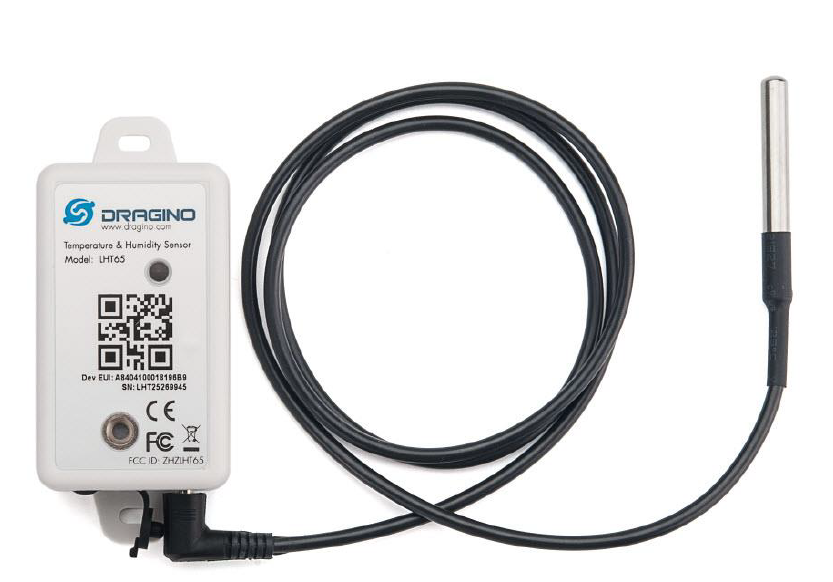

# 02-Low-Power-LoRa-Sensor-Node

## Overview

Development of a low-power embedded sensor node for periodic acquisition and wireless transmission of field data using LoRa.

The project involved the design and integration of the embedded system, including sensor acquisition, LoRa communication, real-time clock management and low-power operation.

The node was later integrated into a larger industrial telemetry platform and used as a data source for a transformer digital model.

```text
low-power-lora-sensor-node/
│
├── README.md
│
├── firmware/
│   ├── main.c
│   ├── sx1276.c
│   ├── sx1276.h
│   └── ...
│
├── hardware/
│   ├── photos/
│   └── diagrams/
│
├── gateway/
│   └── README.md
│
└── docs/
    └── ...
```

# Low-Power LoRa Sensor Node

## Overview

Development of a low-power embedded sensor node for periodic acquisition and wireless transmission of environmental and battery data using LoRa.

The project was developed by reprogramming a commercial Dragino sensor platform based on an STM32L072 microcontroller and an SX1276 LoRa transceiver. The original firmware was replaced with custom firmware to implement sensor acquisition, battery monitoring, LoRa communication, real-time clock management and low-power operation.



*Original commercial sensor platform showing the embedded electronics.*


The node periodically acquires temperature, relative humidity and battery voltage, transmits the data through LoRa, and then enters a low-power state until the next scheduled measurement.

The resulting node was later integrated into a larger industrial telemetry platform and used as a data source for the **Industrial Transformer Digital Twin** project.

## System Architecture

```text
┌─────────────────────────┐
│      SHT20 Sensor       │
│ Temperature / Humidity  │
└────────────┬────────────┘
             │ I²C
             ▼
┌─────────────────────────┐
│       STM32L072         │
│                         │
│  Sensor acquisition     │
│  Battery monitoring     │
│  RTC / Low Power        │
└────────────┬────────────┘
             │ SPI
             ▼
┌─────────────────────────┐
│        SX1276           │
│      LoRa 915 MHz       │
└────────────┬────────────┘
             │ LoRa
             ▼
┌─────────────────────────┐
│      Dragino LG02       │
│         Gateway         │
└────────────┬────────────┘
             │ MQTT
             ▼
       Data Platform
```

## Hardware

* **Microcontroller:** STM32L072
* **LoRa transceiver:** SX1276
* **Temperature / humidity sensor:** SHT20
* **Real-time clock:** STM32 internal RTC
* **Battery monitoring:** ADC using internal voltage reference (VREFINT)


*Sensor node hardware and main components.*

## Sensor Acquisition

Temperature and relative humidity are acquired from the SHT20 sensor through the STM32 I²C interface.

The firmware performs the sensor conversions and processes the raw measurements into temperature and relative humidity values.

Battery voltage is monitored through the STM32 ADC using its internal voltage reference (VREFINT), allowing the firmware to estimate the device supply voltage.

The resulting telemetry data is then prepared for wireless transmission.

## LoRa Communication

The SX1276 transceiver is controlled directly from the STM32 through SPI.

The firmware configures the radio for operation at **915 MHz** using:

* Bandwidth: **125 kHz**
* Coding Rate: **4/5**
* Spreading Factor: **SF7**
* Transmit power: **14 dBm**
* Preamble: **8 symbols**

The transmission process writes the telemetry payload to the SX1276 FIFO, starts transmission and waits for the **TxDone** interrupt before returning the radio to sleep mode.


*Example of LoRa packets received from the custom sensor node.*

## Low-Power Operation

The node was designed to operate periodically while minimizing power consumption.

The operating cycle is:

```text
Wake-up
   ↓
Read sensors
   ↓
Read battery voltage
   ↓
Build telemetry payload
   ↓
Transmit via LoRa
   ↓
SX1276 Sleep
   ↓
STM32 STOP Mode
   ↓
RTC Wake-up
   ↓
Repeat
```

The RTC is configured for a **15-minute wake-up interval**. After transmission, the SX1276 is placed in sleep mode and the STM32 enters STOP mode until the next RTC interrupt.

## Gateway Integration

The sensor node was integrated with a **Dragino LG02** gateway for LoRa reception and forwarding of telemetry data.

The gateway received the LoRa transmissions from the sensor node and forwarded the resulting data through the MQTT infrastructure.


*Dragino LG02 configuration used for LoRa reception and data forwarding.*

## Data Pipeline

```text
Sensor Node
    ↓
   LoRa
    ↓
Dragino LG02
    ↓
   MQTT
    ↓
 Node-RED
    ↓
Data Storage / Processing
```


*Telemetry data flow from MQTT through Node-RED.*

## Technologies

**Embedded:** STM32L072 · C · STM32 HAL · RTC · Low-Power Modes

**Sensors:** SHT20 · ADC · VREFINT · I²C

**Wireless:** SX1276 · LoRa · SPI · 915 MHz

**Integration:** Dragino LG02 · MQTT · Node-RED

## Integration with Digital Twin

The sensor node was later integrated into an industrial telemetry system and used as a data source for a digital model of a distribution transformer.

→ **Industrial Transformer Digital Twin**
